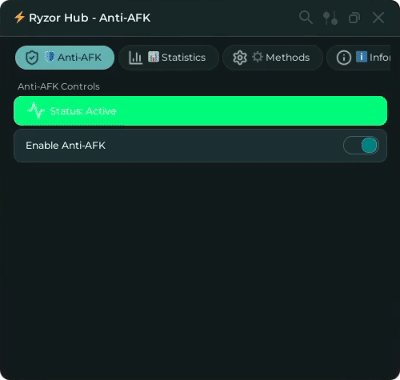

# 🛠️ Misc Scripts - Universal Tools

Welcome to the **Misc Scripts** collection! These are standalone universal tools that work across all Roblox games.

## 📋 Available Tools

### 🛡️ Anti-AFK Tool
**File:** `antiafk.lua`  
**Category:** Utility  
**Compatibility:** Universal (All Games)

A comprehensive Anti-AFK solution with multiple prevention methods and real-time statistics tracking.

#### ✨ Features:
- **Multiple Prevention Methods**:
  - Virtual Input (Primary - Most Reliable)
  - Mouse Movement (Subtle camera adjustments)
  - Random Key Presses (Simulated movement inputs)
  - Random Walking (Character movement)
- **Real-time Statistics**:
  - Session time tracking
  - Kicks prevented counter
  - Total uptime monitoring
- **Professional Interface**:
  - Beautiful Rayfield UI
  - Multiple organized tabs
  - Configurable settings
  - Persistent configuration storage
- **Smart Detection**:
  - Automatic idle detection
  - Intelligent kick prevention
  - Background operation modes

#### 🎮 How to Use:
1. Launch from Ryzor Hub → "⚡ Ryzor Hub" → "🚀 Load Anti-AFK Hub"
2. Configure your preferred prevention methods in the "⚙️ Methods" tab
3. Monitor your session statistics in the "📊 Statistics" tab
4. The tool runs automatically in the background

#### 📊 Interface Preview:


---

## 🚀 Quick Start

### Loading Individual Scripts
```lua
-- Load Anti-AFK directly
loadstring(game:HttpGet('https://raw.githubusercontent.com/Its3rr0rsWRLD/Ryzor/main/scripts/misc/antiafk.lua'))()
```

### Loading via Ryzor Hub
1. Execute the main Ryzor loader
2. Navigate to "⚡ Ryzor Hub" tab
3. Click "🚀 Load Anti-AFK Hub" for the full experience

## 🔧 Technical Details

### Requirements
- **Roblox Executor** with HTTP requests enabled
- **Internet Connection** for loading Rayfield UI library
- **Compatible with all major executors**

### Security Features
- **Undetected Methods**: Uses legitimate Roblox services when possible
- **Randomized Timing**: Prevents pattern detection
- **Minimal Footprint**: Lightweight and efficient operation
- **Safe Defaults**: Conservative settings out-of-the-box

## 📈 Roadmap

### Planned Additions
- 🔄 **Auto-Rejoin Tool** - Automatic server rejoining
- 🎯 **Universal ESP** - Cross-game player/item highlighting
- 🔧 **Developer Tools** - Remote spy, script analyzer
- 🌐 **Server Tools** - Ping monitor, server hopping

*Have a suggestion? Join our Discord community to request new tools!*

## 🤝 Contributing

We welcome contributions to expand our misc tools collection! 

### Adding New Tools
1. Create your tool with Rayfield UI
2. Follow our coding standards (no comments, clean code)
3. Add comprehensive error handling
4. Test across multiple games
5. Submit a pull request

### Asset Guidelines
- **GIFs**: 720p, 10-15 seconds, < 5MB
- **Screenshots**: 1080p PNG format
- **Documentation**: Clear, concise, user-friendly

## 📞 Support

- **Issues**: Report bugs via GitHub Issues
- **Discord**: Join our community for real-time support
- **Updates**: Follow the repository for new releases

---

## 📄 License

These tools are provided as-is for educational and personal use. Please respect Roblox's Terms of Service and use responsibly.

---

*Made with ❤️ by Its3rr0rsWRLD*  
